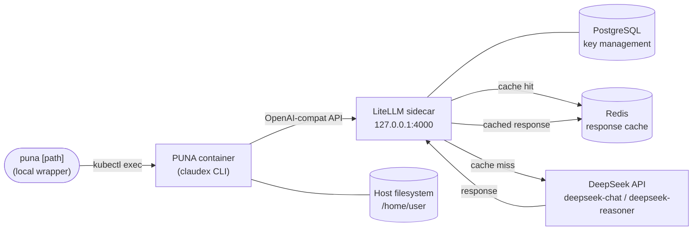

# PUNA — Coding Agent on Kubernetes

**Juan Cordero** — Data / Platform Engineer
[LinkedIn](https://www.linkedin.com/in/juan-cordero-034989112/) · [GitHub](https://github.com/jjcorderomejia) · jjcorderomejia@gmail.com

---

A self-hosted coding agent running on Kubernetes. PUNA (Claude Code CLI fork) runs in a pod, routes every API call through a LiteLLM sidecar to DeepSeek, and caches responses in Redis. You connect via `puna` and get a full coding assistant with direct access to your server filesystem — no cloud subscription, no data leaving your cluster.

Designed as portable IaC: a client installs the full stack on any K8s cluster with a single command.

---

## How it works



PUNA starts with `CLAUDE_CODE_USE_OPENAI=1` pointing at `http://localhost:4000`. LiteLLM receives the request, authenticates it via master key (stored in K8s secret), checks Redis (TTL 2h), and either returns the cached response or forwards to DeepSeek. LiteLLM uses PostgreSQL for key and spend management.

The PUNA container mounts the server user's home directory at the same path it has on the host, so all projects are immediately available at their real paths — no syncing, no cloning. Agent memory persists in `.claude/` inside each project directory, exactly as Claude Code does locally.

Two models are available:

| Model | Use |
|-------|-----|
| `deepseek-chat` (V3) | Default — all coding tasks, 60s timeout |
| `deepseek-reasoner` (R1) | Architecture decisions, complex debugging, algorithm design, 300s timeout |

---

## Startup chain

Two phases precede any running pod: **build** and **apply**. Both are prerequisites — the pod cannot start until both are complete.

**Build (CI, `build.yml`)**
GitHub Actions builds the Docker image on every merge to `master`, packages the PUNA binary, and pushes to GHCR. The image contains every binary available to PUNA at runtime — `git`, `jq`, `kubectl`. Adding a new runtime tool means changing `Dockerfile` and triggering a new build.

**Apply (`deploy.sh` / `bootstrap.sh`)**
Renders `.tpl` manifests via `envsubst`, then applies them in order: namespace → postgres → redis → configmap → **netpol** → puna deployment → rollout restart. `netpol.yaml` is applied here — it defines every network destination the pod is allowed to reach. Adding a new external endpoint (an API, the K8s API server) requires an egress rule in `netpol.yaml` before the pod needs it.

**Pod startup (K8s-orchestrated)**

```
Init containers — sequential, all must exit 0 before main containers start:
  1. seed-claude-config   seeds /home/node/.claude config; copies SSH keys from
                          hostPath into emptyDir volume at /home/node/.ssh
  2. wait-for-postgres    blocks until PostgreSQL accepts connections on :5432
  3. wait-for-redis       blocks until Redis responds to PING on :6379

Main containers — start in parallel after init containers complete:
  litellm                 LiteLLM on 127.0.0.1:4000, backed by PostgreSQL (key mgmt)
                          and Redis (response cache)
  claudex                 tail -f /dev/null; SSH keys at /home/node/.ssh;
                          kubectl available via ${HOST_HOME}/.kube/config
```

**Capability model**

`Dockerfile` and `netpol.yaml` are the two-part enabler for any new pod capability:

| Capability | Enabler | What changes |
|---|---|---|
| New runtime binary | `Dockerfile` | `apk add` → CI rebuilds image |
| New network destination | `netpol.yaml` | egress rule → re-apply manifest |

Both must be in place before the pod starts. The image is immutable at runtime; network paths cannot be opened without a policy update. Every capability PUNA has maps back to an entry in one or both of these files.

---

## Stack

| Layer | Technology | Version |
|-------|-----------|---------|
| Agent CLI | PUNA (Claude Code fork) | vendored |
| API router | LiteLLM | v1.83.7 (pinned) |
| Key management | PostgreSQL | 16-alpine |
| Response cache | Redis | 7-alpine |
| Inference | DeepSeek API | V3 / R1 |
| Workspace | hostPath (server home dir, same path as host) | — |
| Registry | GHCR | — |
| Platform | Kubernetes | — |

---

## Design decisions

**LiteLLM runs as a sidecar, not a separate service.** PUNA and LiteLLM share `localhost:4000` — no service discovery, no network policy to manage, no cross-pod latency. The tradeoff is that scaling the pod scales both containers together, which is acceptable for a single-user coding agent.

**LiteLLM authenticates requests via master key backed by PostgreSQL.** LiteLLM v1.83+ requires a database for key management. PostgreSQL 16-alpine runs as a dedicated pod with a 1Gi PVC. The master key is auto-generated at bootstrap and shared between LiteLLM and the PUNA container — no human ever sees it.

**PUNA source is vendored from a controlled fork.** `vendor.sh` clones from `github.com/jjcorderomejia/Claudex` — a standalone mirror with upstream bug fixes and full PUNA rebranding applied. The `.git` directory is stripped. The image build has no outbound network dependency on any third-party repo.

**The PUNA container stays alive waiting for `kubectl exec`.** `CMD` is `tail -f /dev/null` — the container is a persistent shell host, not an auto-running process. All sessions are initiated via the local `puna` wrapper. Model selection (`deepseek-chat` vs `deepseek-reasoner`) is set by the `puna` entrypoint via `OPENAI_MODEL` env var at session start.

**Build and deploy are fully separated.** CI (GitHub Actions) owns the image build and pushes to GHCR via OIDC — no stored credentials anywhere. `bootstrap.sh` and `deploy.sh` only apply K8s manifests; they never invoke Docker.

**Every image is signed.** CI signs each image by digest using cosign keyless signing (OIDC-based, no private key). The signature proves the image came from this repository's CI pipeline and has not been tampered with in the registry.

**PUNA runs as non-root; LiteLLM runs as its own user.** The PUNA container runs as the `node` user (uid 1000). LiteLLM runs as whatever user its upstream image specifies. PostgreSQL runs as uid 999. All containers drop Linux capabilities and disable privilege escalation. The pod enforces `seccompProfile: RuntimeDefault`.

**Network policy enforces least privilege.** The puna pod has no ingress and restricted egress: DNS, Redis (in-cluster), PostgreSQL (in-cluster), and port 443 to public IPs (DeepSeek API). Redis and PostgreSQL pods accept connections only from the puna pod. `kubectl exec` tunnels through the K8s API server and is unaffected.

**All manifest variables are template-substituted.** `puna.yaml.tpl`, `postgres.yaml.tpl` use `envsubst` at apply time. `${PUNA_IMAGE}` selects the image tag; `${HOST_HOME}` is the server user's home directory; `${STORAGE_CLASS}` selects the PVC storage class (default: `local-path`) — making the stack portable across any K8s cluster and any user with no file edits required.

**Secrets are typed once, never stored in files.** `bootstrap.sh` prompts for the GHCR read-only token and DeepSeek API key on first run. `LITELLM_MASTER_KEY`, `REDIS_PASSWORD`, and `POSTGRES_PASSWORD` are generated with `openssl rand -hex 32` — no human ever sees them. All subsequent runs skip the prompt if the secrets already exist in K8s.

**`puna` enforces K8s-only execution.** The entrypoint checks for `KUBERNETES_SERVICE_HOST` (injected automatically into every K8s pod) and exits with the correct command if run outside the cluster.

---

## Authentication

| Credential | Who types it | When | After that |
|---|---|---|---|
| GHCR push | nobody | — | OIDC — CI proves identity automatically |
| GHCR pull token | user | once, during `./bootstrap.sh` | stored in K8s, never asked again |
| DeepSeek API key | user | once, during `./bootstrap.sh` | stored in K8s, never asked again |
| LiteLLM master key | nobody | — | auto-generated by `openssl rand` |
| Redis password | nobody | — | auto-generated by `openssl rand` |
| PostgreSQL password | nobody | — | auto-generated by `openssl rand` |

After `./bootstrap.sh` runs once, zero human interaction is required at runtime.

---

## Deploy

**First-time / client install — one command:**

```bash
./bootstrap.sh
```

Checks prerequisites (`kubectl`, `openssl`, cluster access), prompts for registry pull token and DeepSeek API key, generates all internal secrets, applies manifests, and waits for a healthy rollout.

**Override image, home dir, or storage class (optional):**

```bash
PUNA_IMAGE=ghcr.io/jjcorderomejia/puna-claudex:abc1234 ./bootstrap.sh
HOST_HOME=/home/alice ./bootstrap.sh      # if running as a different user
STORAGE_CLASS=gp2 ./bootstrap.sh          # EKS
STORAGE_CLASS=standard ./bootstrap.sh     # GKE / AKS
```

**Dev — re-apply manifests with a specific tag:**

```bash
./deploy.sh [IMAGE_TAG]
```

Assumes secrets already exist in K8s. Skips all prompts.

---

## Connect

```bash
puna                          # start in home dir
puna /path/to/project         # start in a specific project
puna --think /path/to/project # R1 reasoning mode
```

All projects are available at their real server paths. Agent memory persists in `.claude/` inside each project directory across pod restarts.

---

## Repo layout

```
puna/
├── .github/
│   └── workflows/
│       └── build.yml           # CI — OIDC push + cosign signing on merge to master
├── agent/
│   ├── CLAUDE.md               # agent persona and behavior rules
│   ├── claude-config.json      # pre-baked config (skips onboarding wizard)
│   ├── settings.json           # model defaults, telemetry off
│   └── puna                    # entrypoint wrapper (K8s-only guard)
├── k8s/
│   ├── namespace.yaml
│   ├── netpol.yaml             # network policy — zero ingress, restricted egress
│   ├── puna.yaml.tpl           # main deployment template (${PUNA_IMAGE}, ${HOST_HOME})
│   ├── postgres.yaml.tpl       # PostgreSQL deployment + service + PVC (${STORAGE_CLASS})
│   ├── redis.yaml
│   └── configmap.yaml          # LiteLLM config mounted into sidecar
├── Dockerfile                  # multi-stage: build PUNA → non-root runtime image
├── vendor.sh                   # clone + strip PUNA source from own fork
├── bootstrap.sh                # one-click install for any K8s cluster
└── deploy.sh                   # dev convenience — apply manifests only
```
