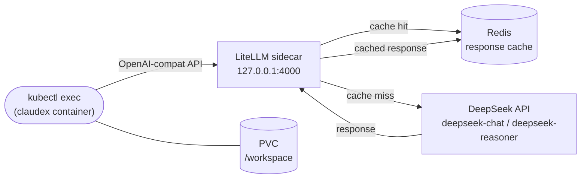

# PUNA — Coding Agent on Kubernetes

**Juan Cordero** — Data / Platform Engineer
[LinkedIn](https://www.linkedin.com/in/juan-cordero-034989112/) · [GitHub](https://github.com/jjcorderomejia) · jjcorderomejia@gmail.com

---

A self-hosted coding agent running on Kubernetes. Claudex (Claude Code CLI) runs in a pod, routes every API call through a LiteLLM sidecar to DeepSeek, and caches responses in Redis. You connect via `kubectl exec` and get a full coding assistant with persistent workspace storage — no cloud subscription, no data leaving your cluster.

Designed as portable IaC: a client installs the full stack on any K8s cluster with a single command.

---

## How it works



Claudex starts with `CLAUDE_CODE_USE_OPENAI=1` pointing at `http://localhost:4000`. LiteLLM receives the request, checks Redis (TTL 2h), and either returns the cached response or forwards to DeepSeek. The model names Claudex sees (`deepseek-chat`, `deepseek-reasoner`) are patched into the source before the image build — the `/model` picker shows only the two DeepSeek models.

Two models are available:

| Model | Use |
|-------|-----|
| `deepseek-chat` (V3) | Default — all coding tasks, 60s timeout |
| `deepseek-reasoner` (R1) | Architecture decisions, complex debugging, algorithm design, 300s timeout |

---

## Stack

| Layer | Technology | Version |
|-------|-----------|---------|
| Agent CLI | Claudex (Claude Code fork) | vendored |
| API router | LiteLLM | v1.83.10 (pinned) |
| Response cache | Redis | 7-alpine |
| Inference | DeepSeek API | V3 / R1 |
| Workspace storage | K8s PVC (configurable storage class) | — |
| Registry | GHCR | — |
| Platform | Kubernetes | — |

---

## Design decisions

**LiteLLM runs as a sidecar, not a separate service.** Claudex and LiteLLM share `localhost:4000` — no service discovery, no network policy to manage, no cross-pod latency. The tradeoff is that scaling the pod scales both containers together, which is acceptable for a single-user coding agent.

**Claudex source is vendored from a controlled fork with source fixes applied.** `vendor.sh` clones from `github.com/jjcorderomejia/Claudex` — a standalone mirror with no upstream fork relationship — and strips the `.git` directory. The fork contains two upstream bug fixes (orphaned dead code in `Config.tsx`, wrong `ThemePicker` import path) required for the build to succeed. The image build has no outbound network dependency on any third-party repo.

**The claudex container stays alive waiting for `kubectl exec`.** `CMD` is `tail -f /dev/null` — the container is a persistent shell host, not an auto-running process. All sessions are initiated via `kubectl exec ... -- puna`. Model selection (`deepseek-chat` vs `deepseek-reasoner`) is set by the `puna` entrypoint via `OPENAI_MODEL` env var at session start.

**Build and deploy are fully separated.** CI (GitHub Actions) owns the image build and pushes to GHCR via OIDC — no stored credentials anywhere. `bootstrap.sh` and `deploy.sh` only apply K8s manifests; they never invoke Docker.

**Every image is signed.** CI signs each image by digest using cosign keyless signing (OIDC-based, no private key). The signature proves the image came from this repository's CI pipeline and has not been tampered with in the registry.

**Claudex runs as non-root; LiteLLM runs as its own user.** The claudex container runs as the `node` user (uid 1000, built into `node:20-alpine`). LiteLLM runs as whatever user its upstream image specifies — forcing uid 1000 onto it breaks its internal path writes. Both containers drop all Linux capabilities and disable privilege escalation. The pod enforces `seccompProfile: RuntimeDefault`.

**Network policy enforces least privilege.** The puna pod has no ingress and restricted egress: DNS, Redis (in-cluster only), and port 443 to public IPs (DeepSeek API). The Redis pod accepts connections only from the puna pod. `kubectl exec` tunnels through the K8s API server and is unaffected.

**All manifest variables are template-substituted.** `puna.yaml.tpl` and `pvc.yaml.tpl` use `envsubst` at apply time. `${PUNA_IMAGE}` selects the image tag; `${STORAGE_CLASS}` selects the PVC storage class (default: `local-path`) — making the stack portable across local clusters, EKS, GKE, and AKS without editing files.

**Secrets are typed once, never stored in files.** `bootstrap.sh` prompts for the GHCR read-only token and DeepSeek API key on first run and passes them directly to `kubectl create secret`. `LITELLM_MASTER_KEY` and `REDIS_PASSWORD` are generated with `openssl rand -hex 32` — no human ever sees them. All subsequent runs skip the prompt if the secrets already exist in K8s.

**`puna` enforces K8s-only execution.** The entrypoint checks for `KUBERNETES_SERVICE_HOST` (injected automatically into every K8s pod) and exits with the correct `kubectl exec` command if run outside the cluster.

**Redis requires a password.** Auto-generated at bootstrap and mounted from `puna-secrets/REDIS_PASSWORD` into both the LiteLLM config and the `wait-for-redis` init container. Unauthenticated Redis is not used.

---

## Authentication

| Credential | Who types it | When | After that |
|---|---|---|---|
| GHCR push | nobody | — | OIDC — CI proves identity automatically |
| GHCR pull token | user | once, during `./bootstrap.sh` | stored in K8s, never asked again |
| DeepSeek API key | user | once, during `./bootstrap.sh` | stored in K8s, never asked again |
| LiteLLM master key | nobody | — | auto-generated by `openssl rand` |
| Redis password | nobody | — | auto-generated by `openssl rand` |

After `./bootstrap.sh` runs once, zero human interaction is required at runtime.

---

## Deploy

**First-time / client install — one command:**

```bash
./bootstrap.sh
```

Checks prerequisites (`kubectl`, `openssl`, cluster access), prompts for registry pull token and DeepSeek API key, generates all internal secrets, applies manifests, and waits for a healthy rollout.

**Override image or storage class (optional):**

```bash
PUNA_IMAGE=ghcr.io/jjcorderomejia/puna-claudex:abc1234 ./bootstrap.sh
STORAGE_CLASS=gp2 ./bootstrap.sh   # EKS
STORAGE_CLASS=standard ./bootstrap.sh   # GKE / AKS
```

**Dev — re-apply manifests with a specific tag:**

```bash
./deploy.sh [IMAGE_TAG]
```

Assumes secrets already exist in K8s. Skips all prompts.

---

## Connect

```bash
# Standard mode
kubectl exec -it -n puna deploy/puna -c claudex -- puna

# Reasoning mode (R1)
kubectl exec -it -n puna deploy/puna -c claudex -- puna --think
```

Work persists in the PVC at `/workspace` across pod restarts.

---

## Repo layout

```
puna/
├── .github/
│   └── workflows/
│       └── build.yml           # CI — OIDC push + cosign signing on merge to master
├── agent/
│   ├── CLAUDE.md               # agent persona and behavior rules
│   ├── settings.json           # model defaults, telemetry off
│   └── puna                    # entrypoint wrapper (K8s-only guard)
├── k8s/
│   ├── namespace.yaml
│   ├── netpol.yaml             # network policy — zero ingress, restricted egress
│   ├── puna.yaml.tpl           # main deployment template (${PUNA_IMAGE})
│   ├── pvc.yaml.tpl            # PVC template (${STORAGE_CLASS})
│   ├── redis.yaml
│   └── configmap.yaml          # LiteLLM config mounted into sidecar
├── patch/
│   └── model-picker.sh         # patches Claudex source model list pre-build
├── Dockerfile                  # multi-stage: build Claudex → non-root runtime image
├── vendor.sh                   # clone + strip Claudex source from own fork
├── bootstrap.sh                # one-click install for any K8s cluster
└── deploy.sh                   # dev convenience — apply manifests only
```
